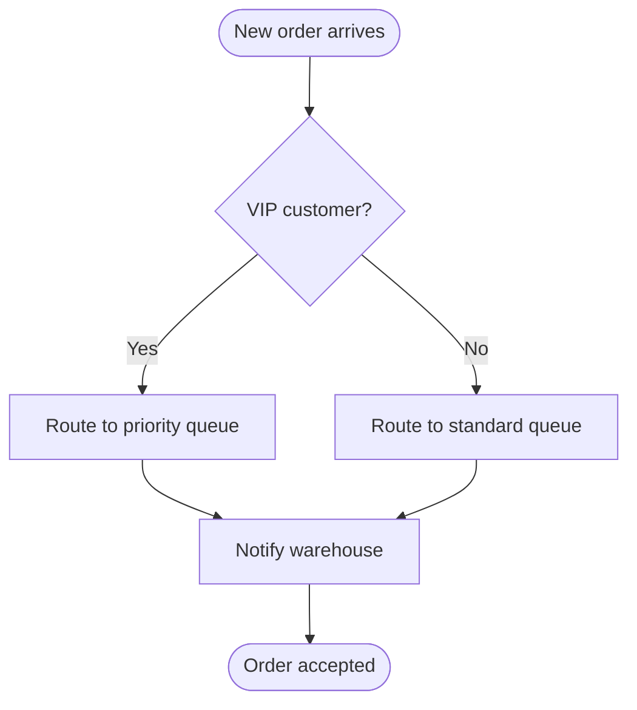

# Request for Comments: [Title]

## Metadata

**RFC ID:** RFC-yyyyMMddHHmm-slug
**Date:** [YYYYMMDD]
**Authors:** [Name (@handle), Team]

## Status

<!-- Choose one: Draft | In Review | Approved | Implemented | Rejected | Canceled -->

| Status | Description |
|--------|-------------|
| Draft | Proposal is being written and not yet submitted for review. |
| In Review | Proposal has been submitted and is under active review by stakeholders. |
| Approved | Proposal has been reviewed and approved for implementation. |
| Implemented | Proposal has been successfully implemented and is live in production. |
| Rejected | Proposal has been reviewed and declined, with reasons documented. |
| Canceled | Proposal has been retracted by its author or team before full evaluation. |

## Summary

[1-2 sentence TL;DR. The reader should know what's being proposed and why before they decide whether to read further.]

## Context

[Describe the current situation and why a change is needed. What problem does this solve?]

## Proposal

[Describe the proposed solution in detail. Be specific about what will change.]

> **Audience note:** RFCs are read by a mixed audience including non-technical stakeholders. Do **not** include exact source code, compiler-specific syntax, or implementation-level snippets.
>
> **Prefer diagrams over text wherever they fit** — a good picture lets a non-developer grasp the proposal in seconds. Reach for pseudo code or prose only when a diagram would not add clarity.

### Diagrams

Include at least one diagram that makes the proposal visually obvious.

> **Default to Mermaid.** Mermaid code blocks render natively in GitHub, GitLab, and most markdown viewers — non-technical reviewers see the diagram inline with zero tooling. Use Mermaid unless a specific case justifies a different tool.

Pick the diagram type that best matches what you're trying to show:

| If you need to show... | Diagram type | Mermaid directive |
|------------------------|--------------|-------------------|
| How services/actors interact over time, request/response ordering | Sequence diagram | ` ```mermaid` + `sequenceDiagram` |
| Decision logic, branching workflows, step-by-step process | Flow chart | ` ```mermaid` + `flowchart TD` (or `LR`) |
| System components, boundaries, data stores, integrations | Architecture / context diagram | ` ```mermaid` + `flowchart` with subgraphs, or `C4Context` |
| Lifecycle of an entity and how it transitions | State diagram | ` ```mermaid` + `stateDiagram-v2` |
| How data moves between systems or transforms | Data flow diagram | ` ```mermaid` + `flowchart LR` |
| Before vs. after of a structural change | Side-by-side comparison | Two adjacent Mermaid blocks |
| Entity relationships / data models | ER diagram | ` ```mermaid` + `erDiagram` |
| Project timeline / delivery plan | Gantt chart | ` ```mermaid` + `gantt` |

**Example — a Mermaid flow chart you can copy and adapt:**

````markdown

````

### Pseudo Code (optional)

When logic genuinely needs a textual walkthrough that a diagram can't capture, write it in **pseudo code** — plain English verbs, no language-specific syntax, no libraries or imports. Example style:

```
When a new order arrives:
    if the customer is a VIP:
        route to priority queue
    otherwise:
        route to standard queue
    notify the warehouse
```

## Alternatives

### Alternative 1: [Name]

[Description and why it was not chosen. Prefer a comparison diagram or table; fall back to pseudo code or plain language — never exact source code.]

### Alternative 2: [Name]

[Description and why it was not chosen. Prefer a comparison diagram or table; fall back to pseudo code or plain language — never exact source code.]

## Open Questions

- [Question 1 - needs to be resolved before implementation]
- [Question 2 - needs to be resolved before implementation]

## Timeline

| Milestone | Target Date |
|-----------|-------------|
| POC Complete | [YYYYMMDD] |
| Staging Rollout | [YYYYMMDD] |
| Production Rollout | [YYYYMMDD] |

## Stakeholders

- [Stakeholder 1 - Role]
- [Stakeholder 2 - Role]

## References

- [Link to related documentation]
- [Link to related ADR]
